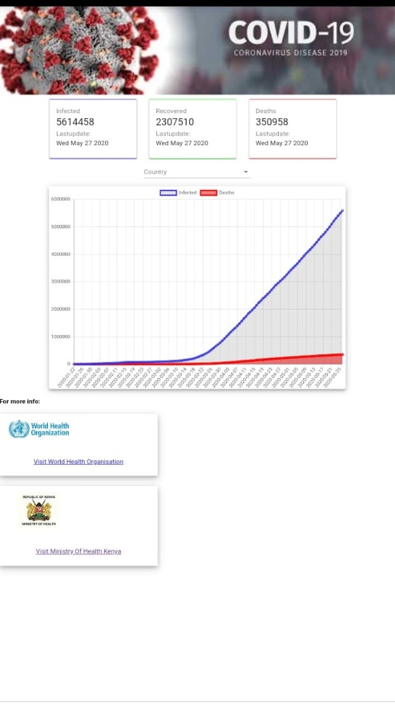

<h1>Tracking-Covid-19-Pandeemic<h1>
  
  Introduction
   <h1><a href="https://tracking-covid-19-pandemic.netlify.app/">Live site here!</a></h1>
   
  <h5>This is a react-app project that gives the current state of the covid-19 pandemic in various countries.</h5>
  
  <h6>The API used was: https://covid19.mathdro.id/api</h6>
  
  
  
 
